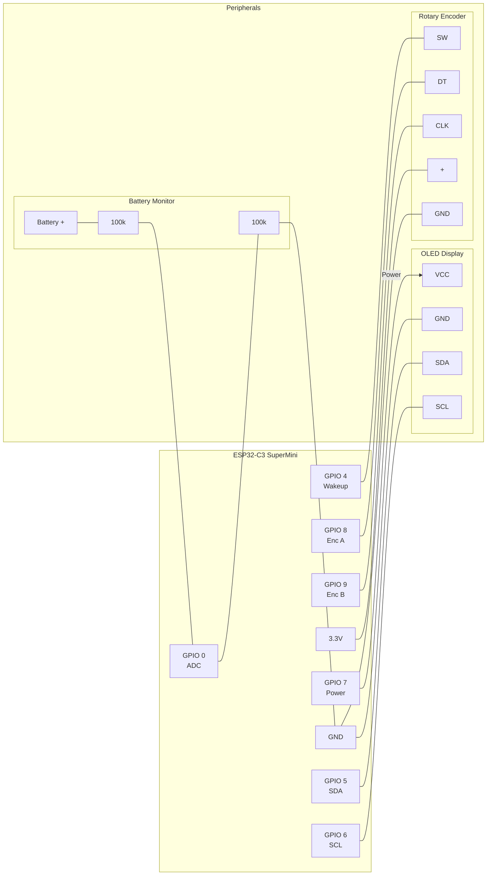

# HARem Hardware Pinout

This document outlines the hardware connections for the HARem Remote Controller (based on ESP32-C3 SuperMini).

## Pin Configuration

| GPIO Pin | Function | Mode | Notes |
| :--- | :--- | :--- | :--- |
| **GPIO 0** | Battery Voltage Monitor | ADC | Through voltage divider (Internal multiplier x2 in config) |
| **GPIO 4** | Encoder Button | INPUT_PULLUP | Inverted, Used as Deep Sleep Wakeup Source |
| **GPIO 5** | I2C SDA | I2C Data | Connect to OLED SDA |
| **GPIO 6** | I2C SCL | I2C Clock | Connect to OLED SCL |
| **GPIO 7** | OLED Power Supply | OUTPUT | Powers the display. Held LOW in deep sleep. |
| **GPIO 8** | Encoder Pin A | INPUT_PULLUP | Rotary Encoder Clock/Data |
| **GPIO 9** | Encoder Pin B | INPUT_PULLUP | Rotary Encoder Clock/Data |

## Power Connections

- **3.3V**: Main power rail for Peripherals (Encoder, etc.)
- **GND**: Common Ground
- **5V / VBUS**: Charging Input (SuperMini handles charging)

## Connection Diagram

