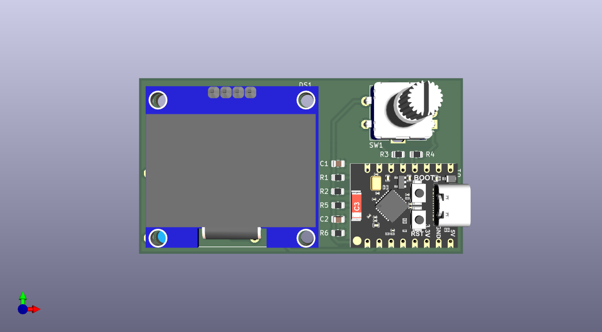

# HARem - Home Assistant Remote Controller

[](https://buymeacoffee.com/orquitto)


**HARem** is a high-performance, minimalist "Thin Client" remote controller designed for the modern smart home. Built on the **ESPHome** ecosystem and powered by the **ESP32-C3**, it provides a boutique-quality physical interface that prioritizes speed, aesthetics, and zero-maintenance operation.

---

## 📛 The Name: HARem
The name **HARem** is a clever portmanteau of **H**ome **A**ssistant and **Rem**ote, but its inspiration runs deeper into Turkish history and culture.

### The Inner Sanctum
In Turkish and Ottoman history, the **Harem** represented the most private, sacred, and protected part of the household. It was a place of extreme importance where the daily life of the family was managed with absolute privacy and care. 

By adopting this name, the project acknowledges the smart home as the modern individual's "inner sanctum." Just as the historical Harem was the heart of the home, this remote serves as the private, primary interface to control and protect the sanctity of your living space. It manages the modern household from a single, intimate point of control, bridging centuries of domestic importance with cutting-edge technology.

---

## 🏛️ Architecture: The "Thin Client" Philosophy
Unlike traditional smart remotes that require manual configuration of every button, HARem operates as a dynamic viewport into your Home Assistant instance.
- **Service-Driven**: Rooms, devices, and states are streamed in real-time.
- **Zero Maintenance**: New devices added to a Home Assistant Area automatically appear on the remote.
- **Infinite Extensibility**: Complex logic is handled by Home Assistant Blueprints and Automations, keeping the hardware lightweight and responsive.

## ✨ Premium Features
- **Modern UI**: A 5-line **1.3" OLED** interface featuring **Outfit** and **Montserrat** typography for a professional, high-end feel.
- **Dynamic Marquee**: Long device names automatically scroll with a smooth marquee effect.
- **Guest Mode Protection**: Secure, PIN-protected "Guest Mode" to restrict access to specific areas or devices.
- **Visual Feedback**: Interactive animations for startup, sleep countdowns, and action confirmations.
- **Power Intelligence**: Configurable standby and deep-sleep modes with precise battery voltage monitoring.
- **Global Control**: Toggle animations and power settings directly from a local on-device menu.

### 🔋 Ultra-Low Power Design
HARem is optimized for maximum battery performance:
*   **Deep Sleep**: Leverages ESP32-C3 deep sleep for sub-1mA idle consumption.
*   **Ultra-Low-Power Divider**: Uses a high-impedance **1MΩ/1MΩ** battery voltage divider to eliminate parasitic drain.
*   **Active Management**: Components like the OLED are completely powered down when the device is dormant.

## 🛠️ Hardware Setup

### Wiring Diagram (ASCII)
```text
       ESP32-C3 Super Mini             Peripherals
    ┌───────────────────────┐        ┌───────────────┐
    │          5V / 3.3V [VCC]──────▶[VCC]  OLED     │
    │                GND [GND]──────▶[GND] (SSD1306) │
    │         GPIO5 (SDA)[SDA]──────▶[SDA]           │
    │         GPIO6 (SCL)[SCL]──────▶[SCL]           │
    │                       │        └───────────────┘
    │                       │        ┌───────────────┐
    │     GPIO8 (CLK)[CLK]◀─┼────────[CLK]  ROTARY   │
    │      GPIO9 (DT)[DT]◀──┼────────[DT]   ENCODER  │
    │    GPIO4 (SW)[Wake]◀──┼────────[SW]   (EC11)   │
    │                GND ◀──┼────────[GND]           │
    │                       │        └───────────────┘
    │   GPIO0 (ADC) [BAT] ◀─┬──[1M]──[+] BAT / +5V  │
    │                      [1M]                     │
    └───────────────────────┴────────▶ GND          │
```

### Pin Mapping Table
| Component | ESP32-C3 Pin | Type | Notes |
| :--- | :--- | :--- | :--- |
| **OLED SDA/SCL** | GPIO5 / GPIO6 | I2C | SSD1306/SH1106 |
| **Encoder CLK/DT** | GPIO8 / GPIO9 | Input | Navigation |
| **Encoder SW** | GPIO4 | Input | Wakeup Trigger |
| **Battery ADC** | GPIO0 | Analog | 1M/1M Divider |

### 🛠️ PCB Design
The HARem PCB is designed to be compact and easy to assemble, housing the ESP32-C3, OLED, and Rotary Encoder in a single unit.



#### Interactive Visualizers
*   **[Interactive 3D Viewer](https://3dviewer.net/index.html#model=https://raw.githubusercontent.com/orkanm/HARem/main/PCB/HArem/HArem.step)**: Examine the 3D model directly in your browser (STEP format).
*   **[Interactive Schematic](https://kicanvas.org/?github=https://github.com/orkanm/HARem/blob/main/PCB/HArem/HArem.kicad_sch)**: Explore the electrical design with KiCanvas.
*   **[Interactive PCB Layout](https://kicanvas.org/?github=https://github.com/orkanm/HARem/blob/main/PCB/HArem/HArem.kicad_pcb)**: Inspect the physical board routing and components.

#### Design Files
*   **[KiCad Project](PCB/HArem/)**: Source files for schematic and board layout.
*   **[3D Model (STEP)](PCB/HArem/HArem.step)**: Industrial standard 3D file for enclosure design.

### 🏠 Housing / 3D Case
The project includes a custom-designed 3D printable case.
*   **[Case Files](Case/)**: STLs and STEP files for the housing and cover.
*   **[Case Assembly Guide](Case/README.md)**: Printing parameters and assembly instructions.


## 🚀 Quick Start
1.  **Hardware**: ESP32-C3 + 1.3" SH1106 OLED + Rotary Encoder.
2.  **Firmware**: 
    *   **Option A (Recommended)**: Download the latest **`.factory.bin`** from [Releases](https://github.com/orkanm/HARem/releases) and flash it to **offset 0x0**.
    *   **Option B**: Compile locally using `esphome run remote_controller.yaml`.
3.  **Home Assistant**: 
    *   The device will appear as "HARem" in your dashboard.
    *   **IMPORTANT**: If you used the GitHub Release binary, you will be asked for an **Encryption Key**:
        > `7knRB3/EL4Fq8Foul7Yhv+pcABzyLXHSQxa9bTzzQqg=`
    *   > [!WARNING]
        > This key is **publicly known**. For security, you should change it in your own configuration and perform an [OTA update](https://esphome.io/components/ota.html) as soon as the device is connected to your Home Assistant.
    *   Follow the [Setup Guide](docs/generic_menu_setup.md) to create Helpers and Automation.

## 📖 Extended Documentation
*   **[Setup Guide](docs/generic_menu_setup.md)**: How to configure Home Assistant.
*   **[Project Walkthrough](docs/walkthrough.md)**: Architecture, features, and troubleshooting.
*   **[Roadmap](TODO.md)**: Planned improvements and future features.

## 🏗️ Building
```bash
esphome run remote_controller.yaml
```

---
*Elevate your Home Assistant experience with a remote that feels as premium as your smart home.*

## ☕ Support the Project
If you find this project helpful and would like to support its development, you can buy me a coffee! Your support helps fund new prototypes and keeps the project open-source and free for everyone. 

[](https://www.buymeacoffee.com/orquitto)
