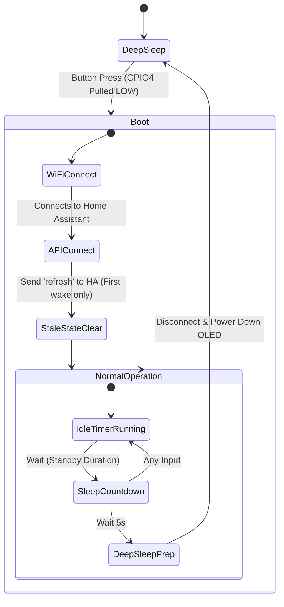
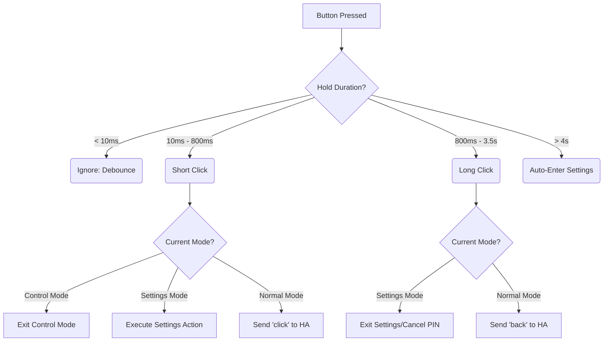
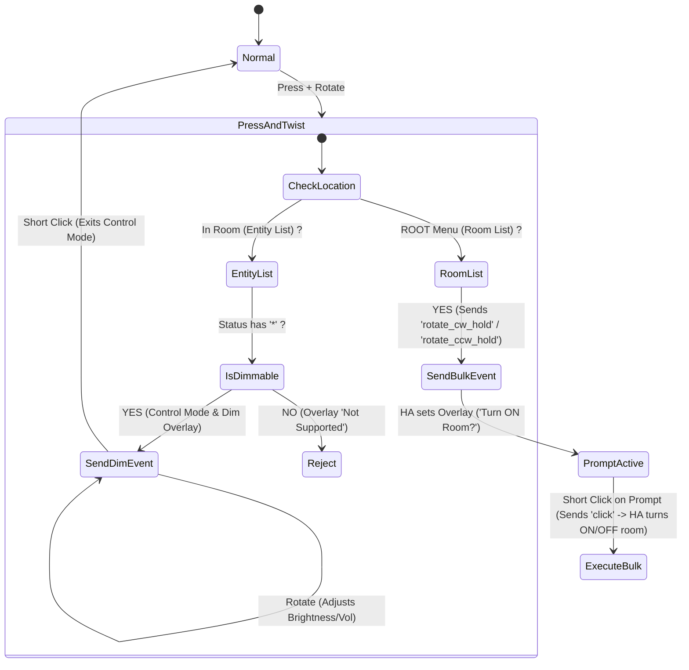
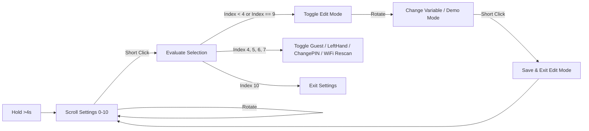
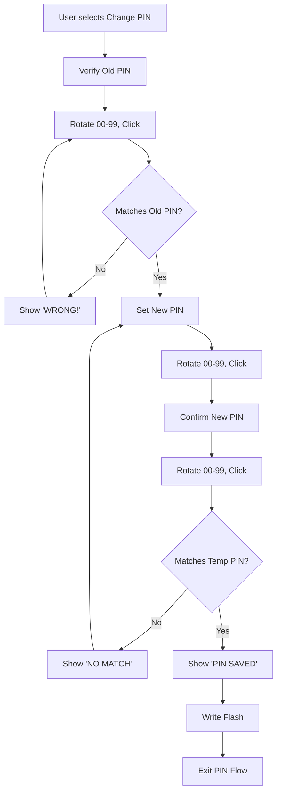

# HARem Extensive Behavior & Interaction Map

This document exhaustively details the state machines, interaction logic, system flows, and failure handling for the HARem controller, based directly on the ESPHome firmware configuration.

---

## 1. System States, Sleep & Power Flow



### Deep Sleep & OLED Power Management
1. **Sleep Entry**: 
   - UI displays "SLEEPING" and a 5-second countdown timer.
   - Screen goes black in software.
   - `GPIO1` is pulled `LOW` and permanently locked using `gpio_hold_en()`. This guarantees the `Q1` NPN transistor cuts power to the OLED `VCC` rail entirely.
   - ESP32-C3 enters deep sleep for 1 day.
2. **Wake Up**:
   - Pushing the rotary encoder wakes the ESP32 via GPIO4.
   - Boot runs: `GPIO1` lock is released (`gpio_hold_dis()`), power is restored to the OLED, and a 100ms delay ensures OLED boot stability.
   - All internal UI states (`settings_mode`, `control_mode`, `guest_pin_mode`, etc.) are reset to `false` to prevent the UI from getting stuck if it went to sleep mid-interaction.

### The "Stale State Clear"
Because the remote connects to Home Assistant asynchronously after waking up, the controller checks `esp_sleep_get_wakeup_cause()`. If it woke from deep sleep, it sets `boot_clear_done = true` and sends a `refresh` event to Home Assistant to wipe out any leftover `line_5` or overlay dimming states from the previous session before rendering the UI.

---

## 2. Encoder Input & Normal Interaction Flow



### The "Sloppy Click" Filter
When pushing the encoder in **Control Mode**, it's common for a user's finger to accidentally rotate the knob a tiny bit during the press/release. 
- If `processed_rotate_hold` is flagged (meaning a rotation occurred while the button was down), the release event is consumed and *ignored* instead of triggering an exit click. This ensures smooth dimming without accidentally exiting.

### Normal Navigation
- **Rotate Clockwise (Free)**: Sends `esphome.remote_action` -> `next`
- **Rotate Counter-Clockwise (Free)**: Sends `esphome.remote_action` -> `prev`

---

## 3. Control Mode & Bulk Power Control Flow

Control Mode allows continuous parameter adjustment (like brightness or volume) or triggering Bulk Room Power Control without sending repetitive clicks.



**Interaction Rules**:
1. **Bulk Room Power**: Executing Press & Twist on the `ROOT` menu sends `rotate_cw_hold` or `rotate_ccw_hold` to Home Assistant, prompting `Turn ON Room?` or `Turn OFF Room?`.
2. **Prompt Click Confirmation**: Short-clicking while a confirmation prompt (ending with `?`) is displayed fires `action: click`, triggering Home Assistant to execute the bulk power service across all included entities.
3. **Hotspot & OTA Guarding**: While the `WIFI FAILED!` hotspot overlay or `UPDATING...` OTA screen is active, all encoder rotations and button events are blocked locally to prevent background state drift.

---

## 4. Settings Menu State Machine

The settings menu is 100% locally rendered, decoupling critical device config from the Home Assistant server.


    
    Eval -->|Index = 4 (Guest)| ToggleGuest[Toggle Guest]
    ToggleGuest -->|If ON| PINFlow
    ToggleGuest -->|If OFF| SendToggle[Send 'toggle_guest']
    
    Eval -->|Index = 6| PINFlow[Enter PIN Flow]
    Eval -->|Index = 7| Rescan[Rescan WiFi]
    Eval -->|Index = 9| Exit[Exit Settings]
```

### Editable Variables
1. **Brightness**: `10%` to `100%` (step 10) - Updates display contrast instantly.
2. **Standby Timer**: `10s` to `300s` (step 10) - `standby_duration_v2`
3. **Sleep Timer**: `10s` to `300s` (step 10) - `sleep_timeout_v2`
4. **Animations**: Toggle `enable_animations_v2` (1 or 0).
5. **Left Hand Mode**: Inverts display rendering 180° for left-handed use.

---

## 5. Security: PIN Validation & Change Flow

To prevent unauthorized users from leaving "Guest Mode", PIN validation is strictly enforced locally. 



---

## 6. Battery & OTA Behavior

### Battery Voltage Monitoring (ADC)
* Uses a high impedance `1MΩ / 1MΩ` voltage divider connected to `GPIO0`.
* The ADC reads raw voltage, multiplies by `2.0`, and converts to a strict `0-100%` scale assuming a LiPo range of `3.0V` to `4.1V`.
* **Low Battery UI Intercept**:
  * If `< 90%` upon boot, a 3-second warning is displayed.
  * If `< 20%` while awake, the screen flashes a high-priority, full-screen "LOW BATTERY!" warning immediately overlaying whatever was on screen.

### OTA Update Handling
* Over-The-Air updates trigger a high-priority override.
* `on_begin`: Idle timer is completely stopped, locking the screen `ON`.
* `on_progress`: Renders a custom full-screen progress bar (`ota_progress`).
* `on_end`: Shows "REBOOTING..." and reboots cleanly.

### Network Fallback
* If Wi-Fi drops, the ESP32 waits 3 minutes (`180s`). If connection isn't restored, it reboots.
* If it cannot connect to any configured Wi-Fi network, it falls back to AP (Captive Portal) Mode. The UI immediately detects this and draws a full-screen alert showing the Hotspot Name, Password, and IP for emergency provisioning.
