# ESPHome Generic Remote Controller - Project Walkthrough

A universal, maintenance-free remote controller for Home Assistant, powered by ESPHome. It automatically discovers your Rooms and Devices, rendering them on a crisp OLED display.

## System Architecture

The remote operates as a "Thin Client". It handles physical I/O and displaying text, while Home Assistant handles all logic, state management, and menu rendering.

```mermaid
sequenceDiagram
    participant U as User
    participant R as ESPHome Remote
    participant HA as Home Assistant
    
    U->>R: Rotates Knob (Next)
    R->>HA: Fires event 'esphome.remote_action' (action: next)
    
    rect rgb(30, 30, 45)
        note right of HA: Automation Triggered
        HA->>HA: Calculate new Index
        HA->>HA: Fetch Areas/Devices List
        HA->>HA: Determine text for 5 Lines
    end
    
    HA-->>R: Updates 'input_text.harem_line_1'
    HA-->>R: Updates 'input_text.harem_line_2'
    HA-->>R: Updates 'input_text.harem_line_3' (Selected)
    HA-->>R: Updates 'input_text.harem_line_4'
    HA-->>R: Updates 'input_text.harem_line_5'
    
    R->>U: Display Refreshes
```

## Features

### 1. Zero-Maintenance Menu
*   **Dynamic**: No hardcoding device names on the chip.
*   **Auto-Sync**: Add a light to a room in HA -> It appears on the remote instantly.
*   **Hierarchical**: `Areas List` -> `Entities List` -> `Toggle Entity`.

### 2. High-Density Display
*   **5 Lines of Context**:
    *   **Lines 1, 2, 4, 5**: Contextual items (Small Font 10px).
    *   **Line 3**: Selected Item (Header Font 12px, highlighted with `>`).
*   **Marquee Effect**: Long text on the selected line auto-scrolls (10Hz smooth animation).

### 3. Navigation Controls
*   **Rotate**: Scroll Up/Down.
*   **Click**: Enter Room / Toggle Device. (Short Click: 10ms - 300ms)
*   **Long Press (301ms+)**: Back to previous menu. (No dead zone)

### 4. Smart Power Management
*   **Standby Mode**: Display turns off after 60s of inactivity to prevent burn-in.
*   **Wake-on-Click**: First click only wakes the device (no accidental actions).

### 5. Action Feedback
*   **Instant Feedback**: "Turning On..." / "Turning Off..." overlay appears immediately on click.
*   **Timeout Logic**: If device state doesn't change in 10s, displays "Failed!".
*   **Auto-Dismiss**: Overlay vanishes instantly when the new state is confirmed by Home Assistant.

### 6. Local Settings Menu
*   **Access**: Long press knob (>1.5s).
*   **Controls**: Rotate to Navigate, Click to Edit/Save.
*   **Features**:
    *   **Brightness**: Adjust OLED contrast (0-100%).
    *   **Standby**: Adjust timeout (10-300s).
    *   **Network Info**: View SSID and IP Address.
*   **Storage**: Settings persist in flash memory (retained after reboot).

### 7. Final Verification (v0.1)
- **Startup**: Verified sequence (Splash -> Waiting -> v0.1).
- **Navigation**: "Back" button reliably returns to previous room.
- **Display**: Long status strings are truncated; short lists use smart masking to prevent duplicates.
- **Versioning**: Centralized version management via `substitutions` block.

## 5. Next Steps
- [ ] Mount hardware in final enclosure.
- [ ] 3D Print case (files not included in this repo).
- [ ] Enjoy!

## Setup Guide

### 1. Home Assistant Helpers
You must create these 7 Helpers in HA (`Settings > Devices & Services > Helpers`):

| Helper Entity ID | Type | Purpose |
| :--- | :--- | :--- |
| `input_text.harem_menu_path` | Text | Tracks current location (`ROOT` or Area Name). |
| `input_number.harem_menu_index` | Number | Tracks scroll position (0-1000). |
| `input_text.harem_line_1` | Text | Display Line 1 content. |
| `input_text.harem_line_2` | Text | Display Line 2 content. |
| `input_text.harem_line_3` | Text | Display Line 3 content (Selected). |
| `input_text.harem_line_4` | Text | Display Line 4 content. |
| `input_text.harem_line_5` | Text | Display Line 5 content. |
| `input_text.harem_overlay` | Text | Feedback Screen Message (Pop-up). |

### 2. Home Assistant Automation
The logic resides in a single automation.
**[View Complete Automation YAML](file:///home/orquitto/.gemini/antigravity/brain/7f522ab7-53ba-4a4e-868a-fc69c6b557ff/generic_menu_setup.md)**

### 3. ESPHome Firmware
The firmware handles hardware debouncing, display rendering, and event transmission.
**[View Firmware Config](file:///home/orquitto/Workspace/HARem/remote_controller.yaml)**

## Troubleshooting

### "Line 5 is missing"
*   **Cause**: You forgot to create `input_text.harem_line_5` in Home Assistant.
*   **Fix**: Create the text helper with that exact Entity ID.

### "Display is blank"
*   **Cause**: Automation hasn't run yet or inputs are empty.
*   **Fix**: Rotate the knob once to force an update.

### "Long press triggers click"
*   **Cause**: You released the button too fast (in the dead zone between 350ms-600ms).
*   **Fix**: Hold the button clearly for >0.6s until you see the action happen.
